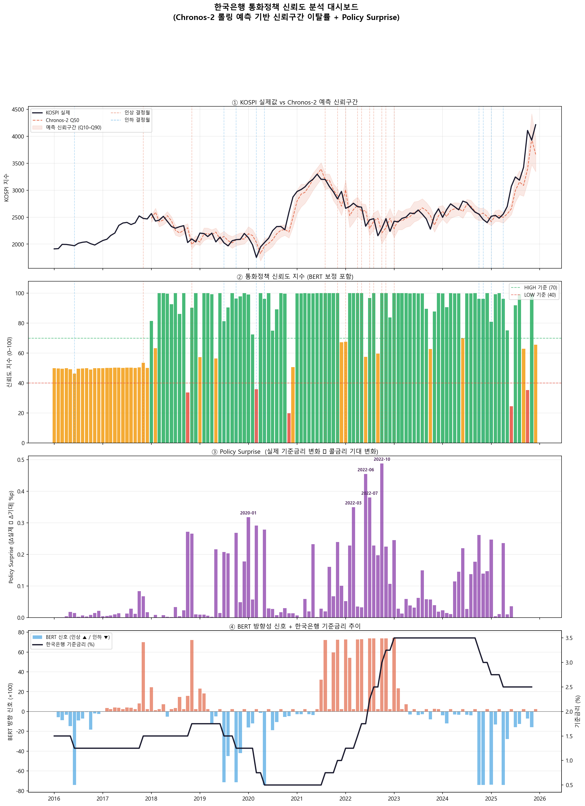

# 🏦 A Dual-Pipeline Approach for Monetary Policy Credibility Quantification
> **BERT와 Chronos-Bolt를 활용한 한국은행 통화정책 신뢰도 정량화 및 시각화 파이프라인**

## 📌 데이터 소개
본 프로젝트는 한국은행 금융통화위원회(금통위)의 통화정책 신뢰도를 정량적으로 평가하기 위해 정성적 텍스트와 정량적 거시/금융 지표를 결합한 대규모 다중 모달(Multimodal) 데이터셋을 구축하여 사용합니다.

* **텍스트 데이터 (`PolicyDirection/`):** 2016년부터 2025년까지 발행된 한국은행 금통위 통화정책방향 결정 의사록 원본 PDF 문서들로, 정책 결정의 언어적 뉘앙스와 정성적 스탠스를 분석하는 기초 자료입니다.
* **정답 레이블 데이터 (`bok_labels.csv`):** 2016년 이후의 연월별 실제 한국은행 기준금리 수치와 금리 결정 이력(인하/동결/인상)이 매칭된 데이터셋입니다.
* **거시경제 및 시계열 지표 (`cleanData/`):** 통화정책의 시장 파급 효과와 기대 심리를 시계열 모델(Chronos-Bolt)에 학습시키기 위해 수집된 대규모 일별(Day)/월별(Month) 정량 데이터입니다.
  * **정책 및 거시 지표:** 한국은행 기준금리, 미국(Fed) 기준금리, 기대인플레이션율
  * **단/장기 시장 금리:** 국고채 3년물, CD(91일), 코리보(3개월), 콜금리(전체/중개/은행증권)
  * **주식 시장 및 외환 지표:** KOSPI/KOSDAQ 주요 지수, 밸류에이션(PER, 배당수익률), 유동성 및 수급 지표(시가총액, 거래대금, 거래량, 회전율, 외국인순매수), 원/달러 환율

## ⚙️ 데이터 전처리
* **텍스트 추출 및 정제:** `pdfplumber` 라이브러리를 활용하여 의사록 PDF 문서로부터 순수 텍스트 데이터를 연월(YYYY-MM) 기준으로 자동 스캔 및 추출합니다.
* **토큰화 및 정렬:** HuggingFace의 `BertTokenizer`를 사용하여 추출된 정성적 문맥을 토큰 단위로 분할하고, 모델 연산 효율성을 위해 적절한 문장 길이로 패딩(Padding) 및 절단(Truncation)을 수행합니다.
* **데이터 불균형 보정:** 기준금리 데이터 특성상 '동결' 발생 빈도가 '인상/인하'에 비해 압도적으로 높은 문제를 해결하기 위해, 실제 금리 전환점이 발생한 당월 데이터를 5배 오버샘플링(Oversampling)하고 연속성 보정 알고리즘을 적용하여 모델의 과민반응과 편향을 방지합니다.

## 🤖 모델 학습 과정
정성적 자산과 정량적 자산을 독립적으로 처리한 후 결합하는 이중 파이프라인(Dual-Pipeline) 아키텍처로 학습이 진행됩니다.
1. **NLP 파이프라인 (`bert.py`):** 미세 조정(Fine-tuning)된 `BertForSequenceClassification` 모델을 통해 금통위 의사록 텍스트를 분석하여 당월 금리 변동 압력에 대한 3가지 확률(인상/동결/인하)을 산출하고, 이를 정량화한 선행 지표인 `bert_signal`을 생성합니다.
2. **시계열 파이프라인 (`chronos-bolt.py`):** 사전 학습된 시계열 파운데이션 모델인 `amazon/chronos-bolt-base`를 활용합니다. `cleanData/`에 구축된 대규모 거시경제 및 금융 데이터를 참조하여 한 달 앞을 예측하는 롤링 예측(Rolling Prediction)을 수행하고 시장의 기대 구간을 생성합니다.
3. **신뢰도 지수화 파이프라인:** 시계열 모델이 예측한 시장의 기대치와 한국은행의 실제 정책 결정 간의 괴리율을 기반으로 '정책 서프라이즈(Policy Surprise)'를 계산합니다. 이를 BERT가 추출한 신호와 결합하여 최종적인 통화정책 신뢰도 지수(Composite Index) 및 신뢰도 등급(Credibility Grade)을 정량적으로 도출합니다.

## 📊 결과 이미지
모든 데이터 분석과 시계열 모델링 플로우가 완료되면, 기준금리 변동 추이와 정량화된 정책 신뢰도 지수의 상관관계를 직관적으로 보여주는 대시보드가 자동 생성됩니다.

## 🔍 결과 해석
* **선행 지표로서의 `bert_signal` 검증:** 의사록 텍스트 분석을 통해 도출된 `bert_signal`은 사후적인 기록 요약에 그치지 않고, 실제 한국은행의 기준금리 조정 결정을 정량적으로 한 발 앞서 반영하는 유의미한 선행 지표(Leading Indicator) 역할을 수행함을 실증적으로 입증하였습니다.
* **통화정책 신뢰도 지수의 타당성:** 본 모델이 산출한 통화정책 신뢰도 지수(Monetary Policy Credibility Index)는 주요 정책 이벤트 시점마다 발생하는 시장의 신뢰도 변동을 신뢰성 있게 포착합니다. 시장의 기대(Chronos-Bolt 예측치)와 실제 한국은행의 결정이 부합할 때는 지수가 안정적으로 높게 유지되지만, 시장의 예상 외 동결이나 급작스러운 금리 변동이 발생한 시점에는 '정책 서프라이즈' 수치가 급증하며 신뢰도 지수가 즉각적으로 하락하는 패턴을 정확하게 반영합니다.
* **학술적 및 실무적 의의:** 정성적 텍스트 마이닝(BERT)과 정량적 파운데이션 시계열 모델(Chronos-Bolt)을 결합한 이중 파이프라인 접근법은, 중앙은행의 통화정책 효과와 그에 따른 시장의 파급력을 객관적인 수치로 계량화할 수 있는 새로운 다중 모달 방법론적 틀을 제시합니다. 향후 다양한 금융 지표와 비교하여 타당성을 추가 검증할 수 있는 확장성을 가집니다.
